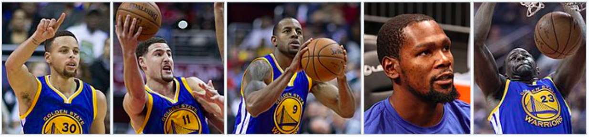
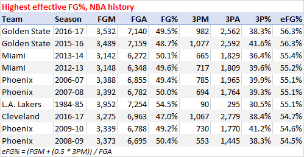

## **Hampton Five ---- the "Death Lineup" of GSW**

```{r out.width='100%',echo=FALSE,fig.align='center'}

```

###**Backround and Motivation**

The commonly know **"Hampton Five"** is the Warriors lineup of [Steph Curry](https://en.wikipedia.org/wiki/Stephen_Curry), [Klay Thompson](https://en.wikipedia.org/wiki/Klay_Thompson), [Andre Iguodala](https://en.wikipedia.org/wiki/Andre_Iguodala), [Kevin Durant](https://en.wikipedia.org/wiki/Kevin_Durant) and [Draymond Green](https://en.wikipedia.org/wiki/Draymond_Green). Death Lineup is a group of smaller basketball players on the [Golden State Warriors](https://en.wikipedia.org/wiki/Golden_State_Warriors) of the National Basketball Association (NBA). Developed under head coach [Steve Kerr](https://en.wikipedia.org/wiki/Steve_Kerr), it began during their 2014–15 run that led to an NBA championship.

Is this the greatest lineup in the history of the league? 
```{r out.width='60%',echo=FALSE,fig.align='left'}

```

Since the Warriors' effective field-goal percentage of 58.5 percent is the highest mark in NBA history, we are wondering how the "Hampton Five" contribute to the shooting performance of the team. In this article, we try to analyse the shooting performance of five players in both visual and quantitative way.

###**Introduction**
```{r out.width='80%',echo=FALSE,fig.align='center'}
knitr::include_graphics('../images/gsw-position.png')
```

**Point Guard**: Greatest shooter of all time. 2x MVP. Only unanimous MVP ever. 5x All Star. 5x All Nba. Solid on defense. In his prime.

**Shooting Guard**: Top 10 shooter of all time. 4x All Star. 2x All Nba. Can get hotter then any player in the history of the game ( 37 point quarter, 60 point half, Game 6 vs OKC, all with super high efficiency). Excellent defender and excellent size at 6'7". Can guard 3 positions and switch on smaller power forwards. One of the best spot up shooters of all time. In his prime.

**Small Forward**: Finals MVP. All Star. 2x All Defense. Still an explosive athlete at 33. Incredible BBIQ and defender. Super smart passer (4 to 1 assist to turnover ration the last 4 years). Great size at 6'7" and ability to guard 3 positions.

**Power Forward**: Top 5 scorer of all time. MVP. Finals MVP. 4x Scoring Champions. 9x All Star. 8x All Nba. Absolutely elite in every phase of scoring: 3 pointers, free throws, mid range, driving, transition, post up. Career averages are basically 50/40/90 shooting splits. 7 foot monster with guard handle. Top 5 in blocks and is quick enough to switch on point guards (guarded Jrue Holiday the entire series). In his prime.

**Center**: DPOTY. 3x All Star. 2x All Nba. 3x All defense. Absolutely elite defender who can guard all 5 positions at a high level. BBIQ on defense is unmatched. On offense he is an excellent passer ( #2 APG for non Guards in the league) and enough of a threat from the 3 point line. In his prime.

```{r message=FALSE,echo=FALSE}
library(knitr)
library(dplyr)
```

### **Data**
In order to analyse the five players' performance in a quantitative way, we use the [data of season 2016](https://github.com/ucb-stat133/stat133-hws/tree/master/data) that records the shooting performance of these players.

The dataset that we used includes these variables for the sake of further analaysis:

Data Name|Data Type|Description
:-----|:---------|:----------------------------------------------
**team_name**|character|Name of the team that the player is currently in
**game_data**|character|The date of the game
**season**|integer|The season(year) of the game
**period**|integer|An NBA game is divided in 4 periods of 12 mins each
**minutes_remaining**|numeric|Amount of time in minutes that remained to be played in a given period
**seconds_remaining**|numeric|Amount of time in seconds that remained to be played in a given period
**shot_made_flag**|character|Whether a shot was made (y) or missed (n)
**action_type**|character|The basketball moves used by players, either to pass by defenders to gain access to the basket, or to get a clean pass to a teammate to score a two pointer or three pointer
**shot_type**|character|Whether a shot is a 2-point field goal, or a 3-point field goal
**shot_distance**|numeric|Distance to the basket (measured in feet)
**opponent**|character|The opponent team of the game
**x**|numeric|The court coordinates(measured in inches) where a shot occurred
**y**|numeric|The court coordinates(measured in inches) where a shot occurred

### **Overall Analysis**
According to this dataset, we plot the shooting performance for "Hampton Five" respectively:
```{r out.width='100%',echo=FALSE,fig.align='center'}
knitr::include_graphics('../images/gsw-shot-charts.png')
```

From the above, we can easily notice that Klay Thompson and Stephen Curry gave more shots  in the games of 2016 season, While Andre Iguodala gave relatively fewer shots in the games. These plots also indicate some shooting features of each player, like roughly half of shots made by Draymond Green are around the three-point line.

### **Further Discussion**

Apart from the number of shooting, how accurate are these shots made by players? In another word, how effective are these shots of each player?In order to figure out this problem, we use the variable "perc_made" to evaluate the percentage of the effective shooting of each player.

#### **2PT Effective Shooting % by Player**
```{r comment = '', echo=FALSE}
shots_data <- read.csv("../data/shots-data.csv", stringsAsFactors = FALSE)
pts2 <- shots_data[shots_data$shot_type == "2PT Field Goal", c("name", "shot_type","shot_made_flag")] %>% group_by(name) %>% summarise(total = sum(shot_type == "2PT Field Goal"), made = sum(shot_made_flag == "shot_yes")) %>% mutate(perc_made = made/total) %>% arrange(desc(perc_made))
kable(pts2)
```

From this figure, we can easily see that Klay Thompson and Kevin Durant made higher 2PT shooting in the games, while Kevin Durant's Effective shooting percentage is relatively higher than Thompson. Also, Andre Iguodala made fewer shots yet possesses the highest effective shooting percentage. Kevin Durant made more than a half shootings inside the three-point line.

#### **3PT Effective Shooting % by Player**
```{r comment = '',echo = FALSE}
pts3 <- shots_data[shots_data$shot_type == "3PT Field Goal", c("name", "shot_type","shot_made_flag")] %>% group_by(name) %>% summarise(total = sum(shot_type == "3PT Field Goal"), made = sum(shot_made_flag == "shot_yes")) %>% mutate(perc_made = made/total) %>% arrange(desc(perc_made))
kable(pts3)
```

From this figure, we notice that regarding 3-point shooting roughly two thirds of shooting in the "Hampton Five". Also, they two have the higher effective shooting percentage.

#### **Effective Shooting % by Player**
```{r comment = '',echo=FALSE}
overall_pts <- shots_data[, c("name", "shot_type","shot_made_flag")] %>% group_by(name) %>% summarise(total = n(), made = sum(shot_made_flag == "shot_yes")) %>% mutate(perc_made = made/total) %>% arrange(desc(perc_made))
kable(overall_pts)
```

Klay Thompson and Stephen Curry no doubt made the remarkable number of shooting in the 2016 season. Kevin Durant has the highest effective shooting percentage which is more than 50%.

###**Conclusion**
Shooting is the most important thing in basketball. The Warriors do it more effectively than any other team in history. The "Hampton Five" contributes tremendously to this remarkable success. According to the previous data and analysis above, **Stephen Curry** and **Klay Thompson** who have highest number of shots and effective shooting over 50 percentage are no doubt the great contributor to the success of GSW.

Is this the greatest lineup in the history of the league? I think it is. They have three elite defenders in Iguodala, Green and Thompson. Three elite shooters in Thompson, Durant and, of course, Steph Curry. And They have four players who have averaged at least five assists in a season.

These five can pass, shoot and defend at an elite level. There’s no such thing as the perfect lineup, but this is the closest they’ll ever get to it.

###**References**
1. [The Warriors new 'Death Lineup' is going to terrorize the NBA](https://ftw.usatoday.com/2016/07/golden-state-warriors-death-lineup-kevin-durant)
2. [Hampton's 5 is the greatest starting lineup of All Time.](https://www.reddit.com/r/nba/comments/8i8gv6/hamptons_5_is_the_greatest_starting_lineup_of_all/)
3. [Wikipedia----Death Lineup](https://en.wikipedia.org/wiki/Death_Lineup)
4. [One Team, One Stat -- Golden State Warriors' shooting the best in NBA history ... again
](https://www.nba.com/article/2017/12/14/one-team-one-stat-warriors-shooting-better-ever)

5. [5 Wild Stats Defining Golden State Warriors' Season](https://bleacherreport.com/articles/2749739-5-wild-stats-defining-golden-state-warriors-season#slide2)